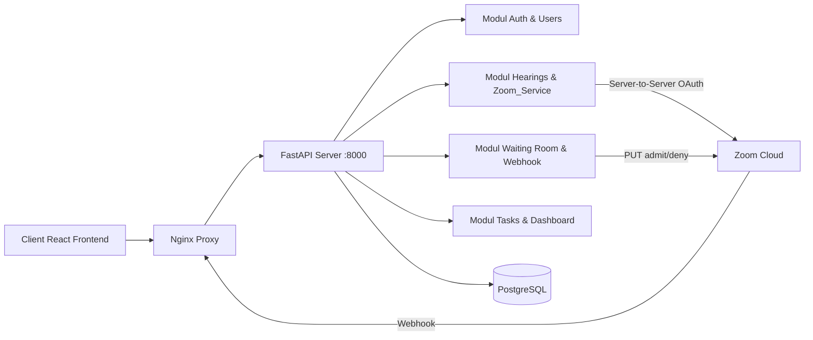
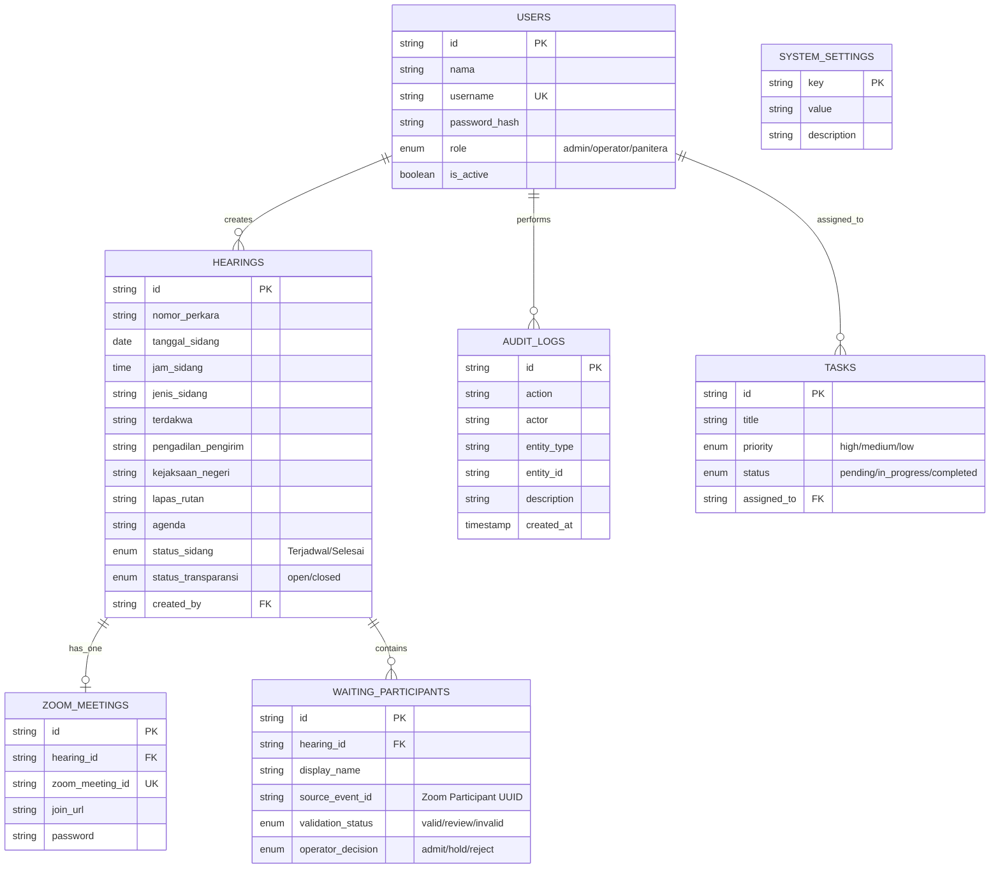

# Backend Blueprint — Practical, Ready-to-Build (Revisi)

Dokumen ini adalah rancangan backend E-CAKRA yang **telah disesuaikan secara aktual** dengan kerangka arsitektur yang sudah terbangun di dalam proyek saat ini.

## 1. Prinsip Desain

- **Modular Monolith**: Tidak memecahnya ke microservices demi kecepatan MVP, namun modul (`auth`, `hearings`, `waiting_room`, dll.) dipisahkan dalam folder tersendiri.
- **Single Database**: PostgreSQL 16 untuk sumber kebenaran data tunggal.
- **REST API + JSON**: Seluruh komunikasi antara React frontend dan backend berjalan di atas format JSON.
- **Authentication via JWT**: Otentikasi aplikasi menggunakan model Token statis pendek usia (15 menit untuk *production*).
- **Role-Based Access Control (RBAC)**: Kontrol level `admin`, `operator`, dan `panitera` diterapkan ketat sebagai penapis di FastAPI (`Depends`).
- **Fail-Fast Security**: Menolak *startup* jika konfigurasi rahasia (*secret*) kosong.

## 2. Diagram Arsitektur Backend (FastAPI)

### Komponen utama

- **FastAPI Server**: Proses utama yang menangani request, routing berbasis *async*, integrasi Zoom API, dan *schema validation* (Pydantic).
- **Modul Auth & Users**: Manajemen identitas lokal dan verifikasi *password hashing* bcrypt.
- **Modul Hearings**: Otomatisasi persidangan dan pembuatan *Zoom Meeting* terikat, serta penghasilan teks *template WhatsApp*.
- **Modul Webhook**: Menangkap *event* kedatangan peserta dari Zoom, memvalidasinya dengan *HMAC-SHA256 signature*, dan mencegah serangan ulangan (Replay Attack).
- **Modul Waiting Room**: Mengatur instruksi pengadilan (Admit, Hold, Reject) yang diteruskan secara nyata kepada API Zoom untuk mengubah status peserta di awan.
- **PostgreSQL**: Sumber data persisten yang dihubungkan melalui *SQLModel (SQLAlchemy)*.

## 3. Diagram Basis Data (ERD) Aktual

Sesuai dengan `app/database/models.py`, berikut adalah arsitektur model dan relasinya yang mengutamakan struktur minimal namun komprehensif:

## 4. Definisi Modul Lanjutan & Keamanan

### A. Zoom API & Webhook (Fail-Fast Validation)
Modul Webhook kami difokuskan untuk keamanan tingkat lanjut karena diekspos secara publik.
1. Setiap pesan dari `/webhooks/zoom` diperiksa keberadaan *Header*-nya (tidak dapat dilewati pada `production`).
2. *Timestamp* kedaluwarsa divalidasi dengan toleransi 300 detik.
3. Fungsi `HMAC-SHA256` digunakan untuk membandingkan *signature* asli Zoom dengan payload.

### B. Validasi Nama Cerdas (Regex Heuristics)
Data yang masuk dari Zoom diproses menggunakan `name_validator.py` untuk menilai apakah:
- `invalid`: Berisi merek HP (Samsung, iPhone) atau anonim (User123).
- `valid`: Terdapat awalan standar pengadilan (JPU -, SAKSI -, HAKIM -).
- `review`: Ada nama, tapi tidak memenuhi sintaks yang sempurna.

### C. Audit Trail Wajib (Non-Repudiation)
Tak satupun tindakan pengubah basis data luput dari pencatatan log. Fungsi `log_action()` secara asinkron (dalam alur *router*) memastikan semua interaksi seperti *Admit Peserta*, *Hapus Sidang*, atau *Gagal Memanggil Zoom API* tercatat di tabel `AuditLog` sebelum mengembalikan respons ke React Frontend.

### D. Nginx Rate Limiting
Nginx telah ditambahkan di level *reverse proxy* Docker Compose untuk menetapkan batas laju (10 *request* per detik, *burst* 20) agar meminimalisir kemungkinan *Denial-of-Service* (DDoS) ke backend Python.

---

Dengan blueprint ini, E-CAKRA membuktikan dirinya sebagai MVP yang tak sekadar memajang antarmuka yang cantik, namun juga tangguh dalam ekosistem peradilan siber karena fondasi struktur datanya, audit trail, serta keamanannya.
